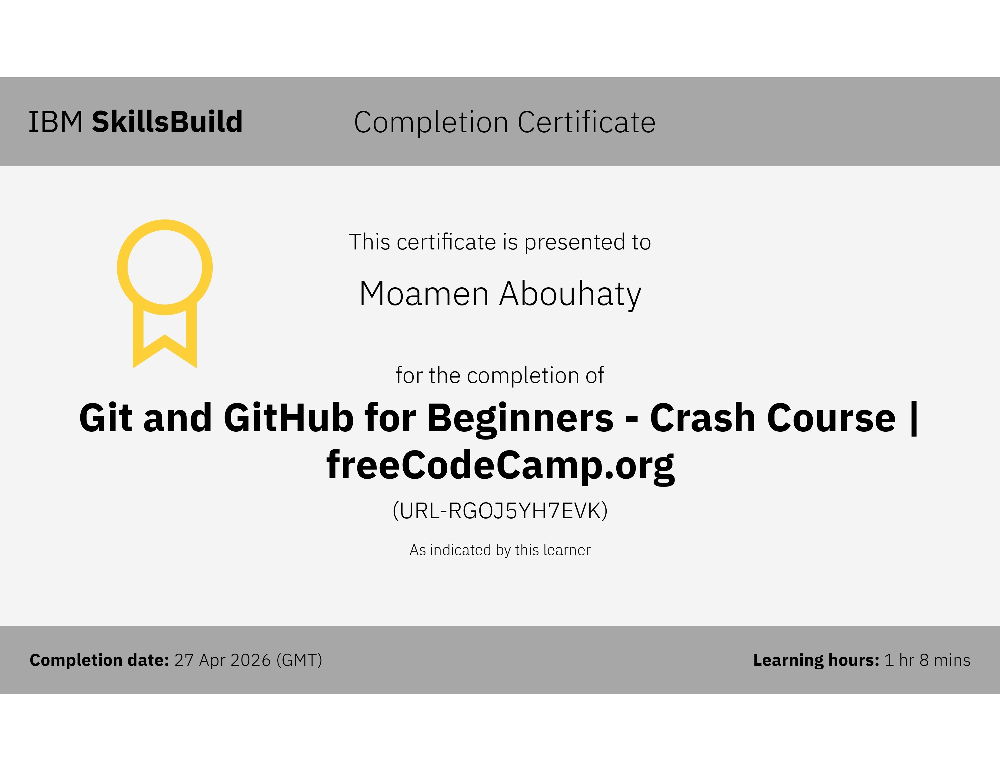

<div align="center">

# Hi There 👋 I'm Moamen

<p align="center">
  
</p>


</div>

---

I am a passionate **Embedded Systems & IoT Engineer** specializing in firmware design and development for microcontrollers, real-time operating systems, and connected devices — bridging the gap between hardware and software, from PCB design all the way to cloud-connected IoT architectures.

---

## 📊 GitHub Stats


## 🏆 GitHub Trophies


### ✍️ Random Dev Quote


### 🔝 Top Contributed Repos


---

## 💻 Programming Languages

| Language | Use Case | Level |
|----------|----------|-------|
|  **C** | Bare-metal firmware, drivers, RTOS | ⭐⭐⭐⭐⭐ |
|  **C++** | Arduino framework, OOP firmware | ⭐⭐⭐⭐⭐ |
|  **Python** | Scripting, automation, Raspberry Pi | ⭐⭐⭐⭐ |
|  **MicroPython** | Rapid IoT prototyping on ESP32/RP2040 | ⭐⭐⭐⭐ |
|  **Assembly (ARM/AVR)** | Bootloaders, ISR optimization | ⭐⭐⭐ |
|  **Rust** | Safe bare-metal on Cortex-M | ⭐⭐⭐ |
|  **Bash** | Build automation, CI/CD scripts | ⭐⭐⭐⭐ |

---

## 🔌 Embedded Platforms

| Family | Boards / MCUs |
|--------|--------------|
| **AVR** | ATmega328P / ATmega2560, ATtiny85 / ATtiny13 |
| **ARM Cortex-M** | STM32 (F0 / F1 / F4 / F7 / H7 / L4), NXP LPC1768, RP2040 |
| **Espressif** | ESP8266, ESP32 / ESP32-S3 / ESP32-C3 (ESP-IDF) |
| **Other** | Raspberry Pi 4 / Pi Zero, PIC16F / PIC18F, MSP430, NVIDIA Jetson Nano |

---

## 📡 Communication Protocols

| Layer | Protocols |
|-------|-----------|
| **Wired** | UART, SPI, I²C, CAN / CAN FD, RS-232 / RS-485, USB (CDC/HID/MSC), Ethernet (LwIP), 1-Wire, LIN |
| **Wireless / IoT** | Wi-Fi 802.11, BLE 5.x, Zigbee, LoRa / LoRaWAN, NB-IoT / LTE-M, MQTT, CoAP, HTTP/S, WebSockets |

---

## ⚙️ RTOS, Frameworks & Cloud

| Category | Tools & Platforms |
|----------|-------------------|
| **RTOS** | FreeRTOS, Zephyr, ChibiOS, mbed OS |
| **HAL / SDK** | STM32 HAL/LL, Arduino Core, ESP-IDF, CMSIS |
| **IoT Cloud** | AWS IoT Core, Azure IoT Hub, Mosquitto, Node-RED, Home Assistant |

---

## 🛠️ Tools & IDEs

| Category | Tools |
|----------|-------|
| **Embedded IDEs** | Arduino IDE 2, PlatformIO, STM32CubeIDE, Keil µVision 5, MPLAB X, IAR, CCS, ESP-IDF |
| **PCB Design** | KiCad 7, Altium Designer, EasyEDA, LTspice |
| **Build & DevOps** | CMake, GNU Make, Git, GitHub Actions, Docker |
| **Test Equipment** | Oscilloscope, Logic Analyzer, Multimeter / LCR Meter, Function Generator |

---

## 🧩 Key Specializations

```
📦 Firmware Architecture  →  Layered HAL / BSP / Application design patterns
⚡ Low-Power Design       →  Sleep modes, dynamic clock scaling, wakeup triggers
🔒 Embedded Security      →  Secure boot, TLS 1.3, hardware crypto engines
🔄 OTA Updates            →  ESP-IDF OTA, MCUboot bootloader, AWS OTA
📐 PCB Design             →  4-layer boards, impedance control, EMC compliance
🧪 Unit Testing           →  Unity, CppUTest, Ceedling for embedded C
📊 Signal Processing      →  ADC filtering, FFT on Cortex-M with CMSIS-DSP
```

---

## 🔹 Badges (Ordered)

<div align="center">

<!-- Fundamentals -->


<!-- Programming -->


<!-- Embedded / IoT -->


</div>

---

## 🔹 Certifications (Ordered)

<div align="center">

<!-- Fundamentals -->


<br/>

<!-- Programming -->


<br/>

<!-- Embedded / IoT -->


<br/>

<!-- Tools -->



<br/>

<!-- Systems Programming -->


</div>

---

## 📋 Certifications Summary

| # | Certification | Issuer | Year |
|---|--------------|--------|------|
| 1 | Using Computers & Mobile Devices | Cisco Networking Academy | 2026 |
| 2 | Digital Awareness | Cisco Networking Academy | 2026 |
| 3 | English for IT: Advice & Time Management | Cisco Networking Academy | 2026 |
| 4 | C Programming Essentials | Cisco Networking Academy | 2026 |
| 5 | Python Programming Essentials | Cisco Networking Academy | 2026 |
| 6 | C Programming: From Basics to Mastery | — | 2026 |
| 7 | Introduction to IoT | Cisco Networking Academy | 2026 |
| 8 | Embedded C: Hardware & Device Drivers | — | 2025 |
| 9 | Arduino Programming | — | 2025 |
|10 | Git & GitHub for Beginners | IBM / freeCodeCamp | 2026 |
|11 | Rust Programming | — | 2025 |

---

## 🤝 Connect With Me

<p align="center">
  <a href="https://github.com/MoamenAbouhaty">
    
  </a>
  <a href="mailto:mabouhaty@gmail.com">
    
  </a>
  <a href="https://www.linkedin.com/in/momen-elsayed-dev/">
    
  </a>
  <a href="https://wa.me/201091871967">
    
  </a>
</p>

---

<div align="center">

*"The closer you are to the hardware, the closer you are to reality."*

⚡ **Built with dedication by Moamen — Embedded Systems & IoT Engineer** ⚡

</div>