<div align="center">


# Hi There 👋 I'm Moamen

<p align="center">
  
</p>


</div>

---

I am a passionate **Embedded Systems & IoT Engineer** with deep expertise in designing, developing, and deploying firmware for microcontrollers, real-time operating systems, and connected devices. I bridge the gap between hardware and software — from schematic design and PCB layout to cloud-connected IoT architectures. I thrive in low-level environments, optimizing performance under tight memory and power constraints.


---

# 📊 GitHub Stats:
<br/>
<br/>


## 🏆 GitHub Trophies


### ✍️ Random Dev Quote


### 🔝 Top Contributed Repo


---

---

## 💻 Programming Languages

> Languages used in embedded systems, firmware development, and IoT applications.

<div align="center">

| Language | Use Case | Level |
|----------|----------|-------|
|  **C** | Bare-metal firmware, drivers, RTOS | ⭐⭐⭐⭐⭐ |
|  **C++** | Arduino framework, object-oriented firmware | ⭐⭐⭐⭐⭐ |
|  **Python** | Scripting, automation, Raspberry Pi, data pipelines | ⭐⭐⭐⭐ |
|  **MicroPython** | Rapid IoT prototyping on ESP32/RP2040 | ⭐⭐⭐⭐ |
|  **Assembly (ARM / AVR)** | Bootloaders, ISR optimization, hardware intrinsics | ⭐⭐⭐ |
|  **Rust (Embedded)** | Safe bare-metal on Cortex-M, no-std | ⭐⭐⭐ |
|  **Bash/Shell** | Build automation, CI/CD scripts | ⭐⭐⭐⭐ |

</div>

---

## 🔌 Microcontrollers & Embedded Platforms

### AVR Family
- **ATmega328P / ATmega2560** — Arduino Uno / Mega core MCUs
- **ATtiny85 / ATtiny13** — Compact, low-power solutions

### ARM Cortex-M Family
- **STM32 Series** (F0 / F1 / F4 / F7 / H7 / L4) — STMicroelectronics Cortex-M MCUs
- **NXP LPC Series** — LPC1768, LPC2148 (ARM7/Cortex-M3)
- **RP2040** — Raspberry Pi dual-core Cortex-M0+ with PIO

### Espressif (Wi-Fi / BT)
- **ESP8266** — Wi-Fi SoC for IoT edge nodes
- **ESP32 / ESP32-S3 / ESP32-C3** — Dual-core Wi-Fi + Bluetooth SoC
- **ESP-IDF** — Native Espressif IoT Development Framework

### Other Platforms
- **Raspberry Pi 4 / Pi Zero** — Linux-based edge computing
- **PIC16F / PIC18F** — Microchip 8-bit microcontrollers
- **MSP430** — Texas Instruments ultra-low-power MCU
- **NVIDIA Jetson Nano** — AI-accelerated edge computing

---

## 🔹 Badges

<div align="center">

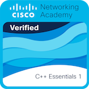
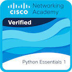
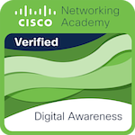

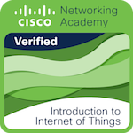
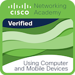

</div>

---

## 🔹 Certifications

<div align="center">

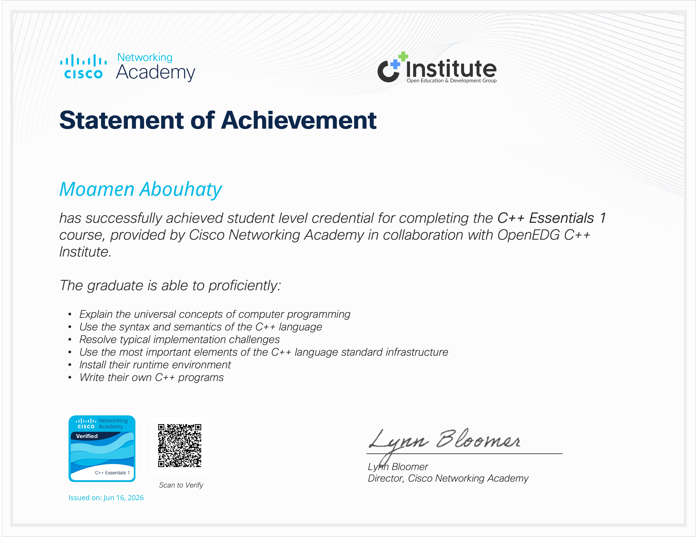
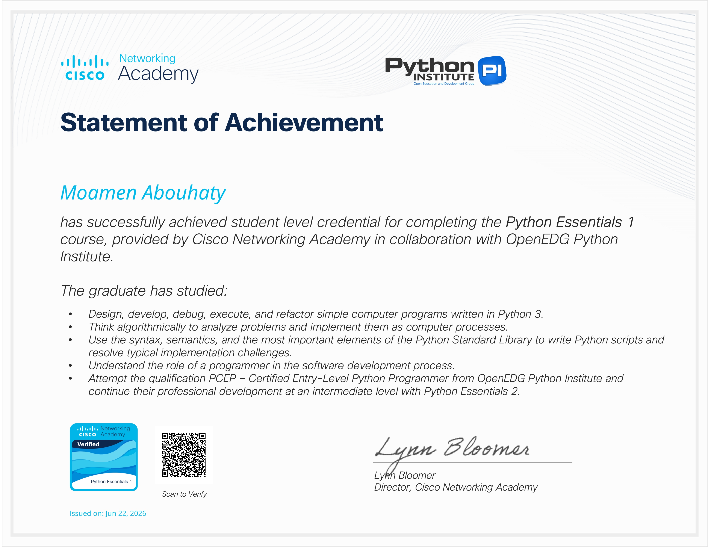
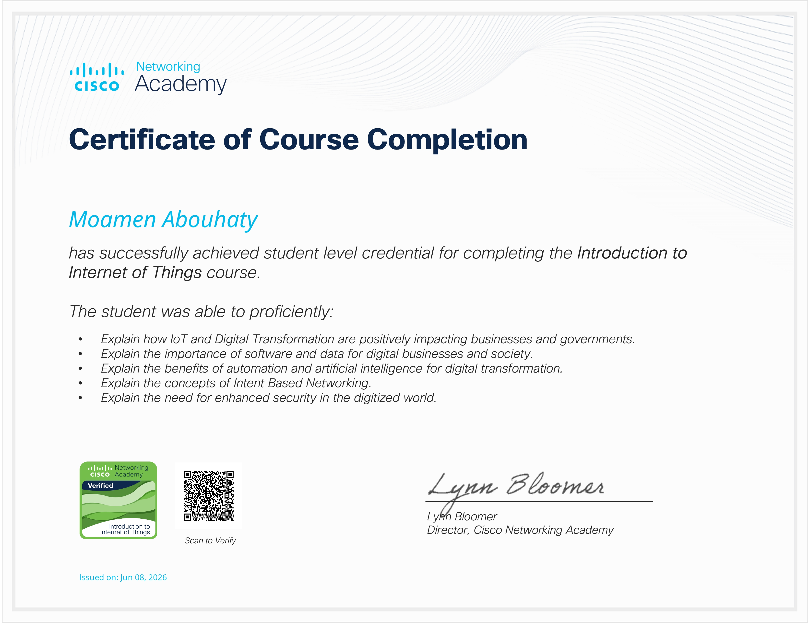

<br/>

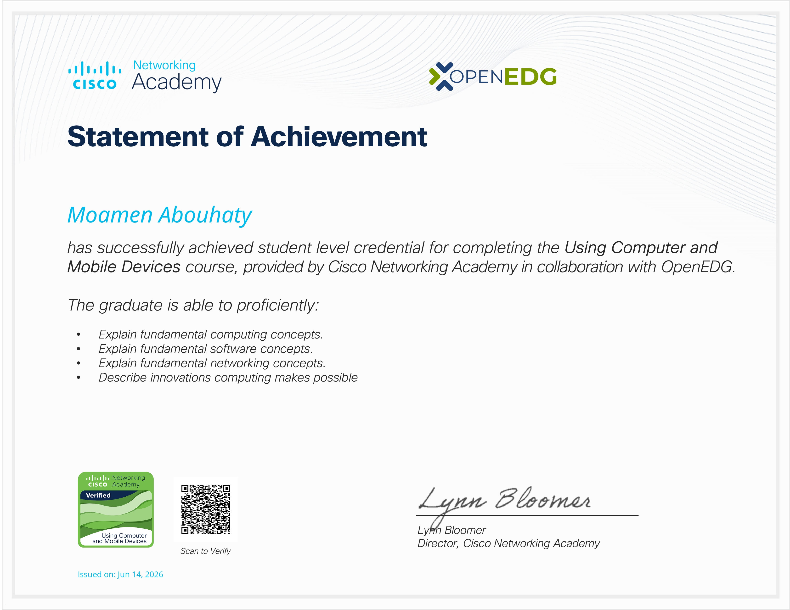
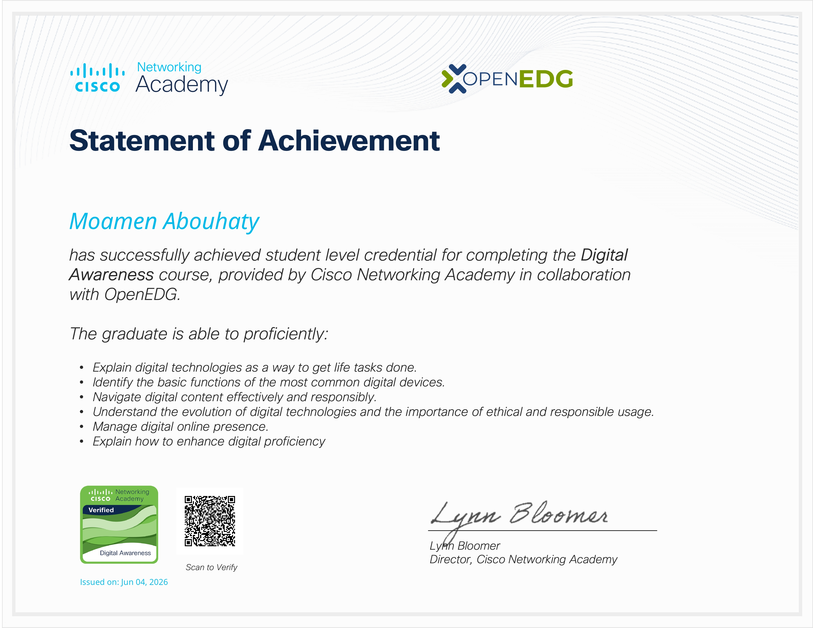
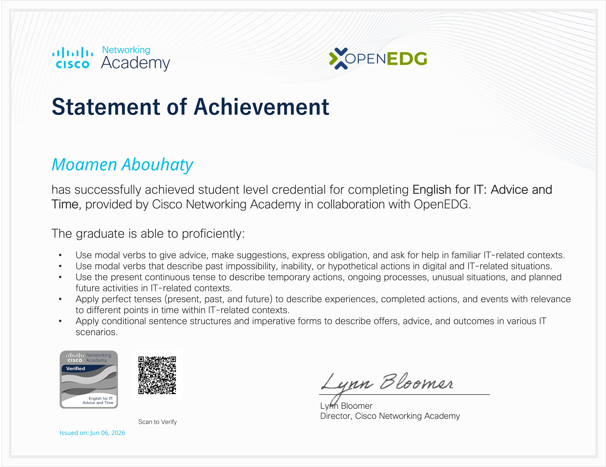

</div>

---

### 📋 Certifications Summary

| # | Certification | Issuer | Year |
|---|--------------|--------|------|
| 1 | C Programming Essentials | Cisco Networking Academy | 2026 |
| 2 | Python Programming Essentials | Cisco Networking Academy | 2026 |
| 3 | Introduction to IoT | Cisco Networking Academy | 2026 |
| 4 | Using Computers & Mobile Devices | Cisco Networking Academy | 2026 |
| 5 | Digital Awareness | Cisco Networking Academy | 2026 |
| 6 | English for IT: Advice & Time Management | Cisco Networking Academy | 2026 |

> 📌 *Full-resolution certificates are available upon request or via LinkedIn.*
---

## 🛠️ Hardware & Development Tools

### Debuggers & Programmers
- **ST-LINK V2 / V3** — STM32 on-chip debugger/programmer
- **J-Link / J-Trace** — SEGGER multi-core ARM debugger
- **AVRISP MkII / USBasp** — AVR ISP programmer
- **OpenOCD** — Open-source on-chip debugging
- **Black Magic Probe** — Open-hardware ARM debugger

### Test & Measurement Equipment
- **Digital Oscilloscope** — Signal analysis, timing verification
- **Logic Analyzer** — Protocol decoding (SPI, I²C, UART, CAN)
- **Multimeter / LCR Meter** — Component & circuit testing
- **Function Generator** — Signal injection and stimulation
- **Power Supply (Bench)** — Precision voltage/current control

### PCB Design Tools
- **KiCad 7** — Open-source PCB design & schematic capture
- **Altium Designer** — Professional PCB layout
- **EasyEDA / EasyEDA Pro** — Cloud-based PCB design
- **LTspice** — Analog circuit simulation

---

## 📡 Communication Protocols

### Wired Protocols (Hardware Layer)
| Protocol | Speed | Use Case |
|----------|-------|----------|
| **UART / USART** | Up to 10 Mbps | Serial debug, GPS, Bluetooth modules |
| **SPI** | Up to 80 MHz | Sensors, flash memory, displays |
| **I²C** | 100k – 3.4 MHz | Sensors, EEPROM, RTC, IMU |
| **CAN Bus** | Up to 1 Mbps | Automotive, industrial networks |
| **CAN FD** | Up to 8 Mbps | High-speed automotive data |
| **RS-232 / RS-485** | Up to 10 Mbps | Industrial serial, multi-drop |
| **USB (CDC/HID/MSC)** | 1.5 Mbps – 480 Mbps | PC interface, mass storage |
| **Ethernet (LwIP)** | 10/100 Mbps | LAN-connected embedded devices |
| **1-Wire** | ~16 kbps | Temperature sensors (DS18B20) |
| **LIN Bus** | Up to 20 kbps | Automotive sub-bus |

### Wireless Protocols (IoT Layer)
| Protocol | Range | Use Case |
|----------|-------|----------|
| **Wi-Fi (802.11 b/g/n)** | ~100 m | Cloud-connected IoT devices |
| **Bluetooth / BLE 5.x** | ~10–50 m | Wearables, beacons, health devices |
| **Zigbee (IEEE 802.15.4)** | ~100 m | Smart home mesh networks |
| **LoRa / LoRaWAN** | ~15 km | Long-range low-power IoT |
| **NB-IoT / LTE-M** | Cellular | Industrial LPWAN, asset tracking |
| **MQTT** | — | IoT message broker protocol (TCP) |
| **CoAP** | — | Constrained devices REST protocol |
| **HTTP / HTTPS** | — | RESTful API integration |
| **WebSockets** | — | Real-time bidirectional IoT streams |

---

## 🖥️ Programming & Development Environments (IDEs)

### Embedded-Specific IDEs
- **Arduino IDE 2.x** — Rapid AVR/ESP prototyping with board manager
- **PlatformIO (VS Code Extension)** — Multi-framework, multi-platform embedded IDE
- **STM32CubeIDE** — ST's eclipse-based IDE with HAL/LL code generation
- **Keil µVision 5** — ARM MDK professional IDE & debugger
- **MPLAB X IDE** — Microchip PIC & AVR professional development environment
- **IAR Embedded Workbench** — High-performance ARM Cortex compiler & IDE
- **Code Composer Studio (CCS)** — Texas Instruments IDE for MSP430 / C2000 / Sitara
- **ESP-IDF (VSCode Plugin)** — Espressif native SDK with FreeRTOS integration

### General-Purpose Editors
- **Visual Studio Code** — With C/C++, Cortex-Debug, PlatformIO extensions
- **CLion** — JetBrains CMake-based C/C++ IDE with embedded support
- **Vim / Neovim** — Terminal-based editing for remote embedded targets

---

## ⚙️ Frameworks, RTOS & SDKs

```c
/* Real-Time Operating Systems */
FreeRTOS       → Tasks, queues, semaphores, mutexes, timers
Zephyr RTOS    → Modular RTOS with device tree (Nordic, ST, NXP)
ChibiOS        → Lightweight RTOS for STM32
mbed OS        → ARM IoT RTOS framework

/* Hardware Abstraction Layers */
STM32 HAL/LL   → STMicroelectronics peripheral abstraction
Arduino Core   → Simplified AVR/ARM/ESP hardware API
ESP-IDF        → Espressif native SDK
CMSIS          → Cortex-M vendor-independent interface

/* IoT Cloud & Middleware */
AWS IoT Core   → MQTT/TLS cloud connectivity
Azure IoT Hub  → Microsoft device management cloud
MQTT Broker    → Mosquitto, HiveMQ, EMQ X
Node-RED       → Low-code IoT flow orchestration
Home Assistant → Open-source smart home platform
```

---

## 🔧 Build Systems & Version Control

<div align="center">


</div>

- **CMake + Ninja** — Cross-platform embedded build system
- **GNU Make** — Traditional firmware build automation
- **Git** — Source control with branch strategies for firmware releases
- **GitHub Actions / GitLab CI** — CI/CD for automated firmware build & test
- **Docker** — Containerized toolchain environments for reproducible builds

---

## 🌐 IoT Cloud Platforms & Services

| Platform | Services Used |
|----------|--------------|
| **AWS IoT Core** | Device Shadow, Rules Engine, Greengrass |
| **Azure IoT Hub** | Device Provisioning, Time Series Insights |
| **Google Cloud IoT** | Cloud Pub/Sub, BigQuery integration |
| **Blynk IoT** | Mobile dashboard for ESP32/Arduino projects |
| **ThingSpeak** | MATLAB-powered IoT data analytics |
| **Adafruit IO** | Beginner-friendly MQTT IoT cloud |
| **Node-RED** | Visual IoT workflow editor |
| **Home Assistant** | Local-first smart home automation |

---

## 🧩 Key Domains & Specializations

```
📦 Firmware Architecture     → Layered HAL, BSP, Application design patterns
⚡ Low-Power Design          → Sleep modes, dynamic clock scaling, wakeup triggers
🔒 Embedded Security         → Secure boot, TLS 1.3, hardware crypto engines
🔄 OTA Updates               → ESP-IDF OTA, MCUboot bootloader, AWS OTA
🛞 Automotive (AUTOSAR)      → Classic AUTOSAR layered architecture concepts
📐 PCB Design                → 4-layer boards, impedance control, EMC compliance
🧪 Unit Testing              → Unity, CppUTest, Ceedling for embedded C
📊 Signal Processing         → ADC filtering, FFT on Cortex-M with CMSIS-DSP
```

---

## 🤝 Connect With Me

<p align="center">

  <!-- Facebook -->
  <!-- <a href="https://www.facebook.com/USERNAME">
    
  </a> -->

  <!-- GitHub -->
  <a href="https://github.com/MoamenAbouhaty">
    
  </a>

  <!-- Gmail -->
  <a href="mailto:mabouhaty@gmail.com">
    
  </a>

  <!-- LinkedIn -->
  <a href="https://www.linkedin.com/in/momen-elsayed-dev/">
    
  </a>

  <!-- Proton Mail -->
  <!-- <a href="mailto:yourname@proton.me">
    
  </a> -->

  <!-- WhatsApp -->
  <a href="https://wa.me/201091871967">
    
  </a>

  <!-- X (Twitter)
  <a href="https://x.com/USERNAME">
    
  </a> -->

</p>

---

<div align="center">

*"The closer you are to the hardware, the closer you are to reality."*

⚡ **Built with dedication by Moamen — Embedded Systems & IoT Engineer** ⚡

</div>