<div align="center">

# Hi There 👋 I'm Moamen

<p align="center">
  
</p>


</div>

---

I am a passionate **Back-End Engineer** specializing in building scalable backend applications, designing RESTful APIs, developing server-side systems, and working with databases and modern backend technologies. My primary focus is **Node.js backend development**, with experience in JavaScript, TypeScript, REST APIs, authentication, databases, and backend architecture.

---

## 📊 GitHub Stats


## 🏆 GitHub Trophies


### ✍️ Random Dev Quote


### 🔝 Top Contributed Repos


---

## 💻 Programming Languages

| Language                                                                                                                         | Use Case                                                          | Level |
| -------------------------------------------------------------------------------------------------------------------------------- | ----------------------------------------------------------------- | ----- |
|  **JavaScript** | Backend development, Node.js, REST APIs, asynchronous programming | ⭐⭐⭐⭐⭐ |
|  **TypeScript** | Scalable backend applications, API development, type-safe systems | ⭐⭐⭐⭐⭐ |
|  **Python**                 | Automation, scripting, backend tools, data processing             | ⭐⭐⭐⭐  |
|  **SQL**                      | Database design, queries, data management                         | ⭐⭐⭐⭐  |
|  **C++**                       | Programming fundamentals and performance-focused applications     | ⭐⭐⭐   |
|  **Rust**                         | Systems programming and performance-focused applications          | ⭐⭐⭐   |
|  **Bash**                      | Linux automation, build systems, CI/CD scripts                    | ⭐⭐⭐⭐  |

---

## 🚀 Backend Development

| Category                     | Technologies                                           |
| ---------------------------- | ------------------------------------------------------ |
| **Runtime**                  | Node.js                                                |
| **Languages**                | JavaScript (ES6+), TypeScript                          |
| **Frameworks**               | Express.js                                             |
| **APIs**                     | RESTful APIs, API Design, Middleware                   |
| **Authentication**           | JWT, bcrypt                                            |
| **Databases**                | MongoDB, Mongoose, MySQL, PostgreSQL                   |
| **Security**                 | CORS, Helmet, Rate Limiting, Environment Variables     |
| **Architecture**             | Clean Architecture, Clean Code, Modular Backend Design |
| **Testing**                  | Jest, Supertest                                        |
| **Queues & Background Jobs** | BullMQ, Redis, node-cron                               |
| **AI Integration**           | Anthropic Claude API, Groq LLaMA API                   |
| **Payments**                 | Stripe Test Webhooks                                   |
| **Documentation & Testing**  | Postman, API Documentation                             |

---

## 🤖 Backend AI Engineering

I build backend systems that integrate modern AI capabilities into production-oriented applications.

```text
🧠 LLM Integration       → Claude API, Groq LLaMA API
📊 Usage Metering        → Token & Cost Tracking
💳 Billing               → Stripe Test Webhooks
🔄 Background Jobs       → BullMQ & Redis
🔐 Authentication       → JWT & bcrypt
📦 API Development       → Node.js & Express.js
🧪 Testing               → Jest & Supertest
🏗️ Architecture         → Clean Architecture & Clean Code
```

---

## 🛠️ Tools & DevOps

| Category               | Tools                                       |
| ---------------------- | ------------------------------------------- |
| **Development**        | Node.js, Express.js, TypeScript, JavaScript |
| **Databases**          | MongoDB, Mongoose, MySQL, PostgreSQL        |
| **Testing**            | Jest, Supertest, Postman                    |
| **Queues / Cache**     | Redis, BullMQ                               |
| **Version Control**    | Git, GitHub, Git Flow                       |
| **Containers**         | Docker                                      |
| **CI/CD**              | GitHub Actions, CI/CD Fundamentals          |
| **Deployment**         | Vercel, Render                              |
| **Package Management** | npm                                         |

---

## 🧩 Key Specializations

```text
📦 Backend Architecture    →  Clean Architecture / Modular Design
🚀 REST API Development   →  Node.js / Express.js
🔐 Backend Security       →  JWT / bcrypt / Helmet / CORS
🗄️ Database Systems       →  MongoDB / MySQL / PostgreSQL
⚡ Async Processing       →  BullMQ / Redis / Background Jobs
🧪 Automated Testing      →  Jest / Supertest
🤖 AI Integration         →  Claude API / Groq LLaMA API
💳 Billing Systems        →  Usage Metering / Stripe Webhooks
🐳 DevOps Fundamentals    →  Docker / GitHub Actions
```

---

## 🔹 Badges

<div align="center">


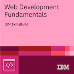

</div>

---

## 🔹 Certifications

<div align="center">

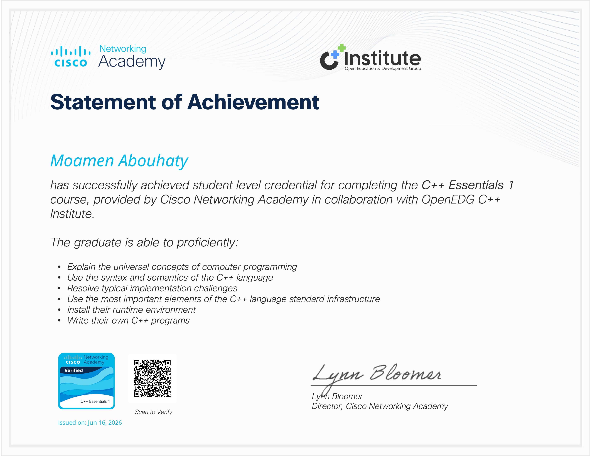
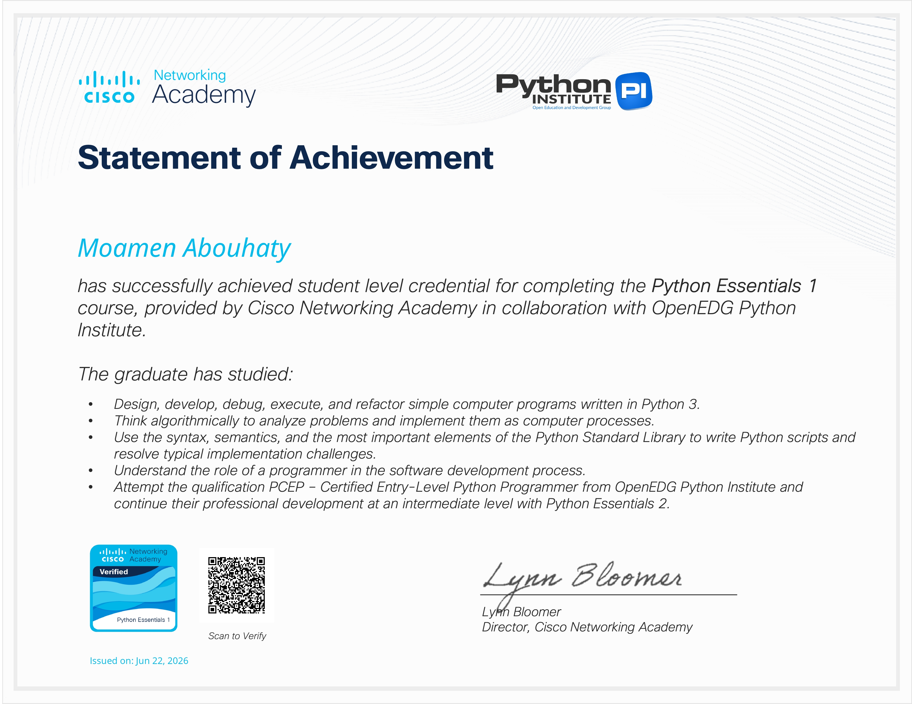


<br/>

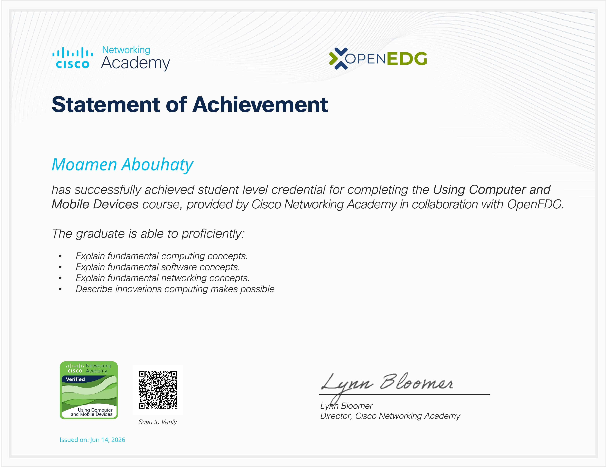
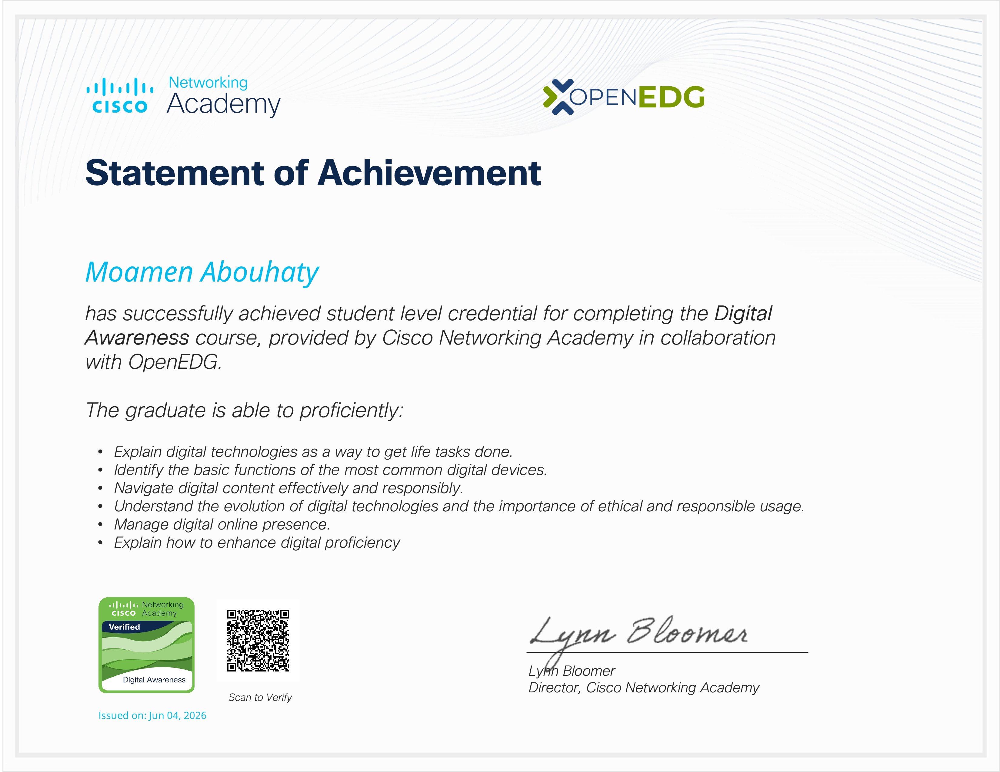
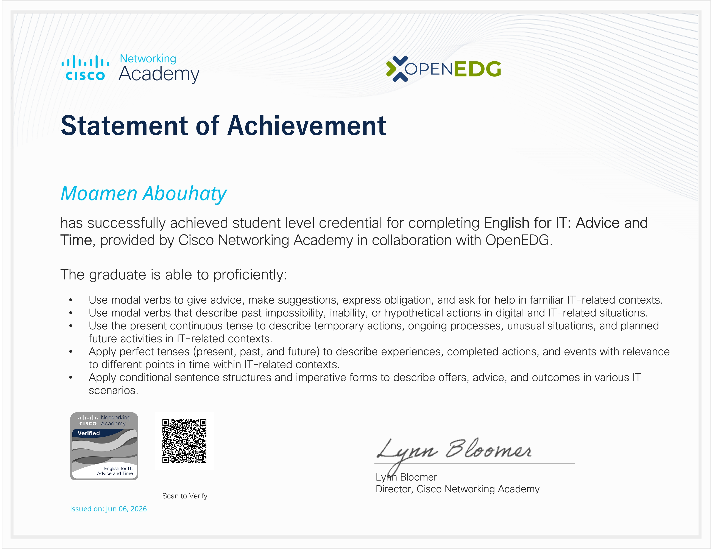

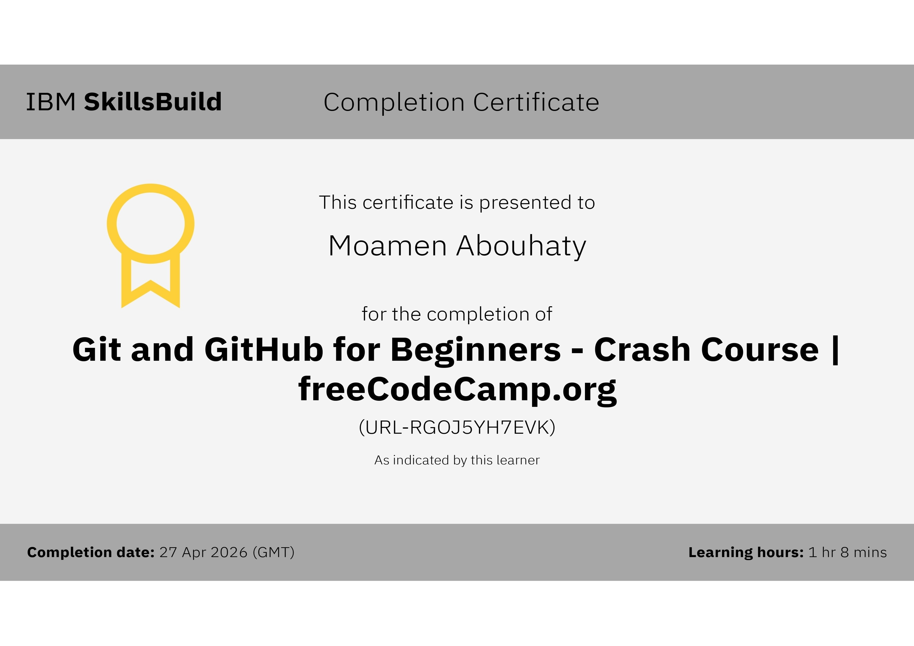


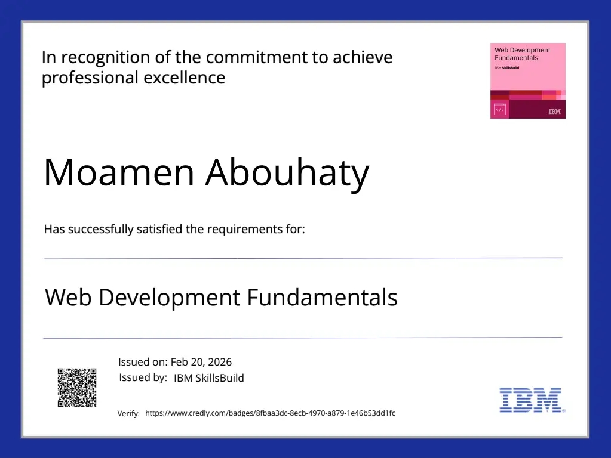
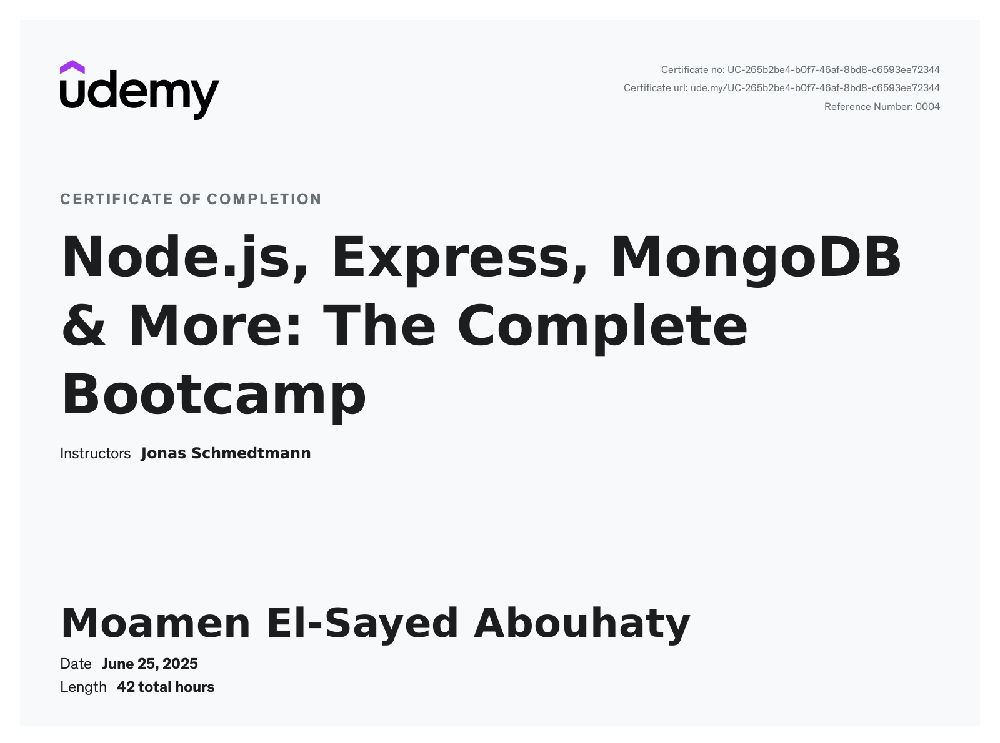
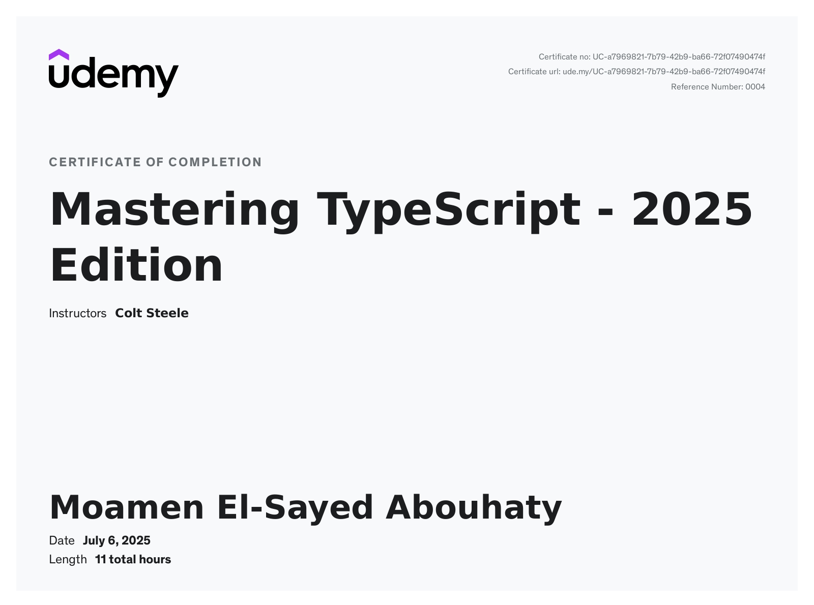
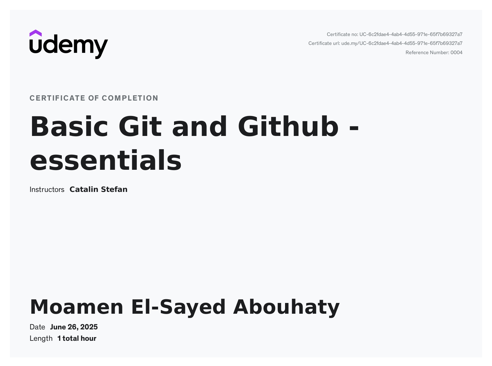
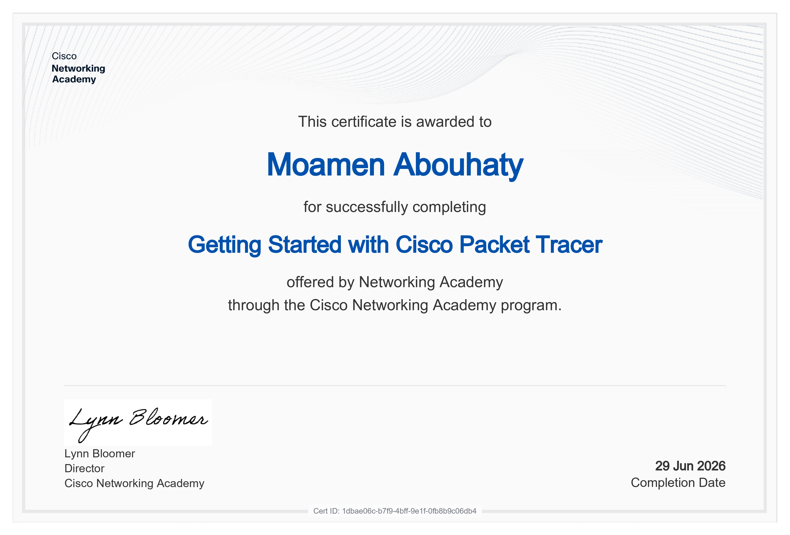

</div>

---

## 📋 Certifications Summary

| #  | Certification                            | Issuer                   | Year |
| -- | ---------------------------------------- | ------------------------ | ---- |
| 1  | Using Computers & Mobile Devices         | Cisco Networking Academy | 2026 |
| 2  | Digital Awareness                        | Cisco Networking Academy | 2026 |
| 3  | English for IT: Advice & Time Management | Cisco Networking Academy | 2026 |
| 4  | C Programming Essentials                 | Cisco Networking Academy | 2026 |
| 5  | Python Programming Essentials            | Cisco Networking Academy | 2026 |
| 6  | C Programming: From Basics to Mastery    | Mahara-Tech              | 2026 |
| 7  | Introduction to IoT                      | Cisco Networking Academy | 2026 |
| 8  | Embedded C: Hardware & Device Drivers    | Mahara-Tech              | 2026 |
| 9  | Arduino Basics                           | M3aarf                   | 2026 |
| 10 | Git & GitHub for Beginners               | IBM / freeCodeCamp       | 2026 |
| 11 | Rust Programming                         | M3aarf                   | 2026 |
| 11 | Getting_Started_with_Cisco_Packet_Tracer | Cisco Networking Academy | 2026 |
| 12 | Web-Development-Fundamentals             | IBM                      | 2026 |
| 13 | Node.js Bootcamp                         | Udemy                    | 2025 |
| 14 | Mastering TypeScript                     | Udemy                    | 2025 |
| 15 | Git And Github                           | Udemy                    | 2025 |

---

## 🤝 Connect With Me

<p align="center">
  <a href="https://github.com/MoamenAbouhaty">
    
  </a>
  <a href="mailto:mabouhaty@gmail.com">
    
  </a>
  <a href="https://www.linkedin.com/in/momen-elsayed-dev/">
    
  </a>
  <a href="https://wa.me/201091871967">
    
  </a>
</p>

---

<div align="center">

*"The closer you are to the hardware, the closer you are to reality."*

⚡ **Built with dedication by Moamen — Back-End Engineer | Node.js** ⚡

</div>
